# PaperLoom: Công cụ dịch PDF giữ nguyên bố cục

<p align="center">
  <a href="README.md">中文</a> · <a href="README.en.md">English</a> · <a href="README.vi.md">Tiếng Việt</a>
</p>

<p align="center">
  
</p>

Khi đọc bài báo, bạn thường phải chuyển qua lại giữa trình đọc PDF, công cụ dịch, Zotero và ứng dụng ghi chú. PaperLoom gom các bước này vào cùng một nơi: nhập tài liệu, phân tích và dịch, đối chiếu bản dịch với bản gốc, hỏi AI về tài liệu, rồi lưu kết quả về Zotero hoặc Obsidian.

PaperLoom được phát triển từ [RetainPDF](https://github.com/wxyhgk/retain-pdf) (MIT) và phát hành độc lập, với dữ liệu và cổng riêng, không ảnh hưởng đến bản gốc. Xin cảm ơn tác giả RetainPDF đã xây dựng nền tảng xử lý, dịch và dàn trang PDF.

## Khả năng dịch và dàn trang

PaperLoom hiện là dự án mã nguồn mở duy nhất dành cho việc dịch PDF dạng ảnh và bản quét mà vẫn giữ nguyên bố cục, với chất lượng dịch và dàn trang ngang bằng, thậm chí vượt qua các sản phẩm thương mại cùng loại.

**PaperLoom vượt trội rõ rệt về công thức nội dòng: sau khi dịch, công thức, mối liên hệ với văn bản xung quanh và bố cục nội dòng vẫn được giữ ổn định—điều mà các dự án dịch PDF mã nguồn mở khác hiện chưa làm được.**

| Dự án | PDF quét | Công thức nội dòng phức tạp | Không dịch nhầm mã nguồn | Kiểm soát bảng | Chiến lược dịch tùy chỉnh | Giữ bố cục | Tối ưu dung lượng PDF | Tự động hóa qua API |
| --- | --- | --- | --- | --- | --- | --- | --- | --- |
| PDFMathTranslate | ❌ | ❌ | ❌ | Hạn chế | Hạn chế | Trung bình | Trung bình | ✅ |
| PolyglotPDF | ❌ | ❌ | ❌ | Hạn chế | Hạn chế | Trung bình | Trung bình | ✅ |
| Doc2X | ✅ | ✅ | ❌ | Khá | Hạn chế | Tốt | Hạn chế | ❌ Không công khai |
| PaperLoom | ✅ | ✅ Bảo toàn tốt | ✅ | ✅ Có thể bật/tắt | ✅ Cấu hình theo quy tắc | Tốt | ✅ Liên tục cải thiện | ✅ |

## PaperLoom làm được gì

- **Dịch PDF và giữ bố cục.** Hỗ trợ PDF có thể chỉnh sửa, PDF dạng ảnh và bản quét, gồm văn bản nhiều cột, hình ảnh, bảng và công thức phức tạp.
- **Quản lý tài liệu tập trung.** Thư viện, bộ sưu tập, mục yêu thích, trung tâm tác vụ và trình đọc đối chiếu bản gốc/bản dịch đều nằm trong cùng một giao diện.
- **Hỏi AI về tài liệu.** Tóm tắt bài báo, tìm hiểu phương pháp hoặc giải thích công thức. Câu trả lời có trích dẫn để quay về trang gốc. PDF Agent hỗ trợ các thao tác với tài liệu cần được bạn cho phép rõ ràng.
- **Nhập từ Zotero và lưu bản dịch về đó.** Hỗ trợ nhập hàng loạt. Với Zotero 10+, bạn có thể lưu PDF đã dịch từng tài liệu hoặc theo lô; lưu lại sẽ cập nhật tệp đính kèm hiện có.
- **Lưu sang Obsidian.** Xuất ghi chú bản dịch tiếng Trung, ghi chú bản gốc tùy chọn, hình ảnh và PDF đã dịch, từng tài liệu hoặc theo lô, kèm thông tin thư mục, liên kết nguồn và liên kết giữa các ghi chú.
- **Cấu hình theo cách làm việc của bạn.** Hỗ trợ MinerU/Paddle OCR, API mô hình, bảng thuật ngữ, chiến lược dịch tùy chỉnh, bảo vệ mã nguồn, kiểm soát bảng, tối ưu dung lượng PDF và API mở. Bạn cũng có thể tự triển khai hoặc phát triển thêm.

Quy trình dịch khôi phục ý nghĩa hoàn chỉnh của nội dung bị ngắt giữa cột, trang hoặc câu trước khi gửi đến mô hình. Cách này giảm tình trạng mất ngữ cảnh khi dịch từng khung riêng lẻ. Thuật toán phông chữ và dàn trang giúp khôi phục công thức và bố cục bài báo nhiều cột.

## Xem kết quả thực tế

Các ảnh bên dưới là tài liệu thật trong thư viện Zotero của người dùng và giao diện PaperLoom, gồm các trường hợp phân tích bằng MinerU VLM, dịch bằng mô hình, tạo PDF, lưu bản dịch về Zotero và xuất sang Obsidian theo lô. Mở các mục thu gọn để xem thêm ảnh; nhấp vào ảnh đặt cạnh nhau để xem bản gốc. Nguồn ảnh được ghi trong [hồ sơ ảnh chụp](resources/brand/readme-gallery/product/SCREENSHOT_SOURCES.md).

### Thư viện và tiến độ tác vụ

Tài liệu sau khi nhập sẽ nằm trong thư viện. Để biết tác vụ đang ở bước nào, mở mục Tiến độ trong trang chi tiết và xem trạng thái OCR, dịch và kết xuất. Tài liệu đã xử lý xong có thể mở để đọc ngay.

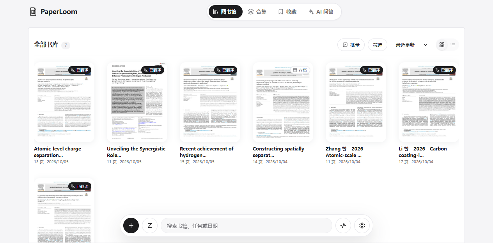

<details>
<summary>Xem tiến độ, nhập từ Zotero và các tệp có thể tải xuống</summary>

Duyệt thư viện và bộ sưu tập Zotero trong PaperLoom, chọn tệp PDF có trên máy và tùy chọn dịch ngay sau khi nhập. Khi xử lý xong, trang chi tiết cung cấp PDF đã dịch, PDF đối chiếu, tệp Word giữ bố cục và gói ghi chú Obsidian.

<table>
  <tr><th>Tiến độ OCR, dịch và kết xuất</th><th>Nhập từ Zotero</th></tr>
  <tr>
    <td width="50%"><a href="resources/brand/readme-gallery/product/paperloom-progress-real.png">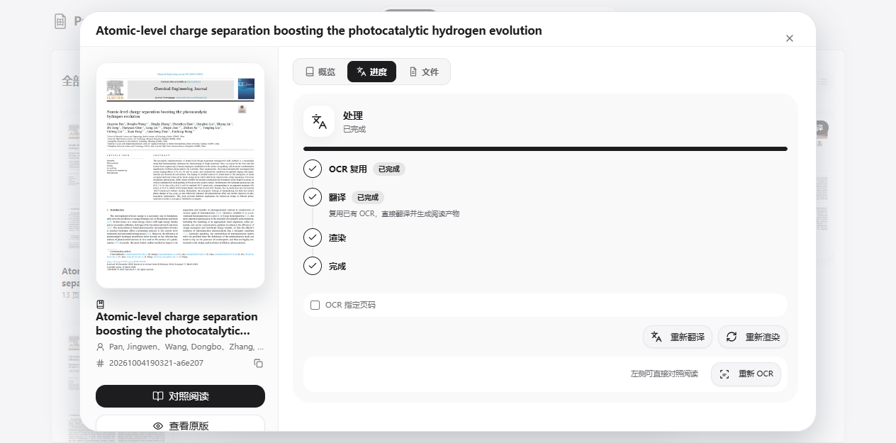</a></td>
    <td width="50%"><a href="resources/brand/readme-gallery/product/paperloom-zotero-import-real.png">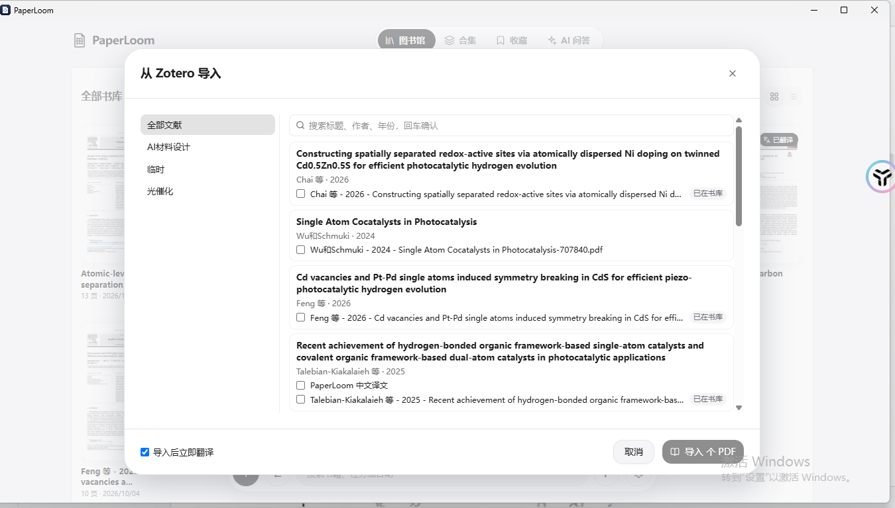</a></td>
  </tr>
  <tr><th colspan="2">Các tệp đầu ra và nút tải xuống</th></tr>
  <tr><td colspan="2"><a href="resources/brand/readme-gallery/product/paperloom-artifacts-real.png">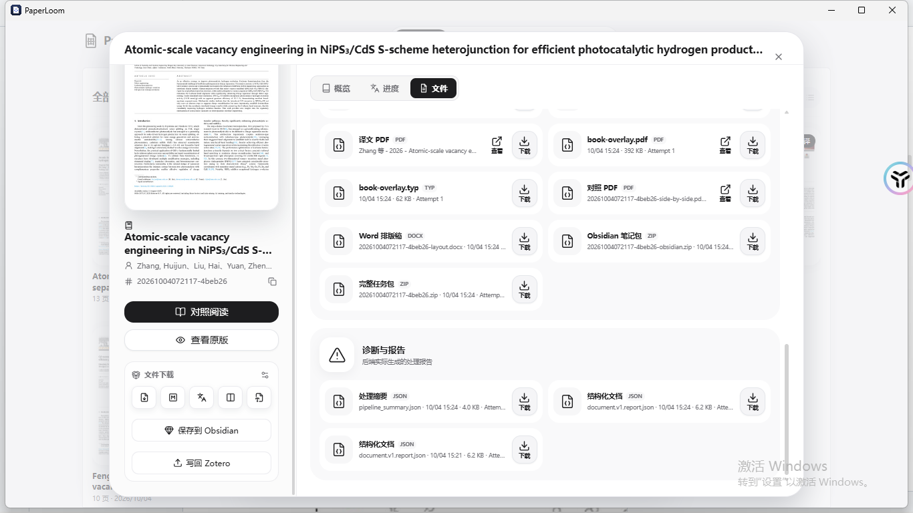</a></td></tr>
</table>

</details>

### Đọc đối chiếu bản gốc và bản dịch

Bản gốc tiếng Anh và bản dịch tiếng Trung của cùng một trang được đặt cạnh nhau để dễ kiểm tra thuật ngữ, công thức, hình, bảng và trích dẫn. Bạn cũng có thể chỉ xem bản gốc hoặc bản dịch.

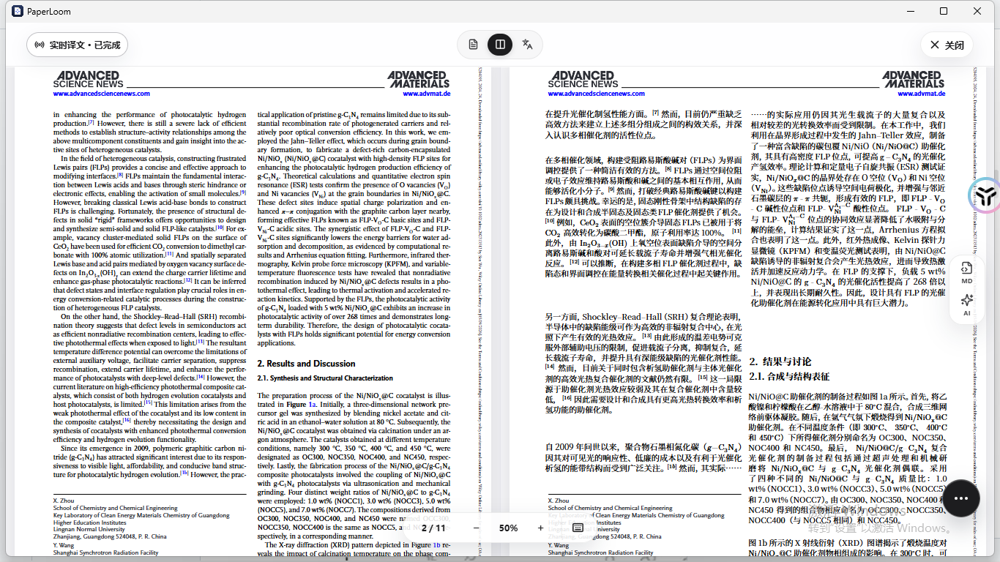

<details>
<summary>Xem hình, chú thích, bảng và công thức</summary>

Các trang có hình và bảng cũng có thể đối chiếu trực tiếp. Bên dưới là hình tổng hợp và chú thích của Yang 2024, cùng văn bản, bảng và công thức của Li 2026.

<table>
  <tr><th>Yang 2024: hình tổng hợp và chú thích</th><th>Li 2026: văn bản, bảng và công thức</th></tr>
  <tr>
    <td width="50%"><a href="resources/brand/readme-gallery/product/paperloom-figures-real.png">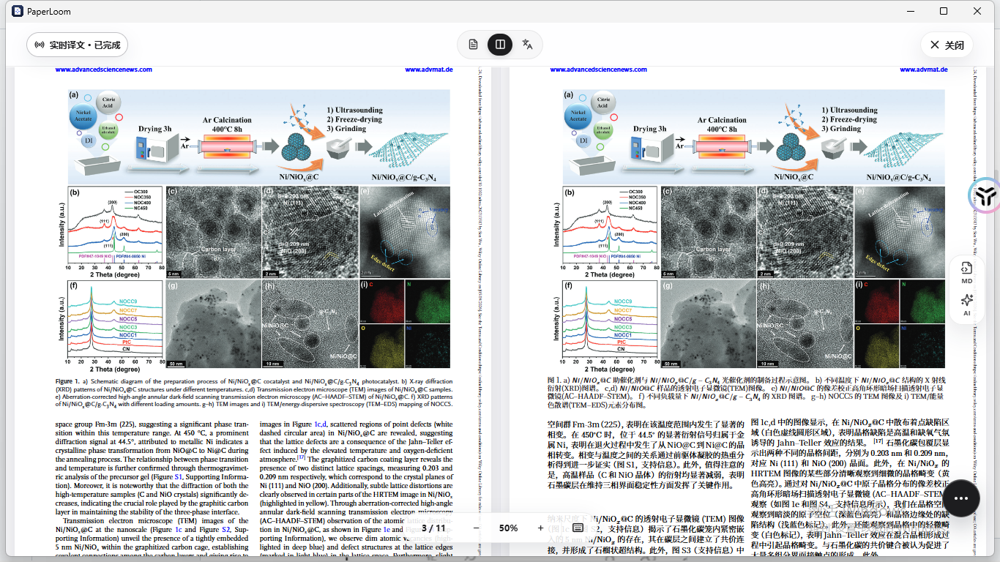</a></td>
    <td width="50%"><a href="resources/brand/readme-gallery/product/paperloom-table-translation-real.png">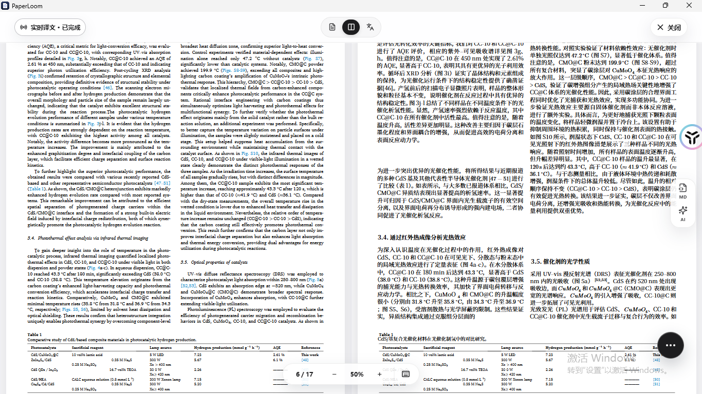</a></td>
  </tr>
</table>

</details>

### Đọc PDF và Markdown cùng lúc

Mở bảng Markdown khi cần sao chép hoặc tìm kiếm nội dung trong lúc đọc PDF gốc. Công thức và hình ảnh hiển thị cùng văn bản; tài liệu dài được tải theo nhu cầu.

<details>
<summary>Xem giao diện đọc PDF và Markdown</summary>

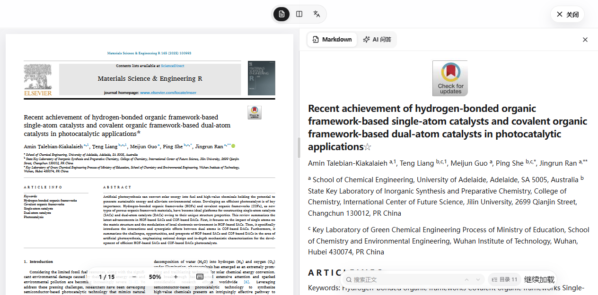

</details>

### Hỏi đáp AI theo tài liệu

Bạn có thể hỏi “Bài báo này dùng phương pháp nào?” hoặc “Số liệu này nằm ở trang nào?”. Ảnh dưới là phần hỏi đáp về tổng hợp và đặc trưng vật liệu trong Yang 2024. AI sắp xếp các bước tổng hợp và phương pháp đặc trưng, kèm trích dẫn tài liệu. Phần xem trước trích dẫn hiển thị số trang, ảnh thu nhỏ và đoạn trích từ bản gốc.

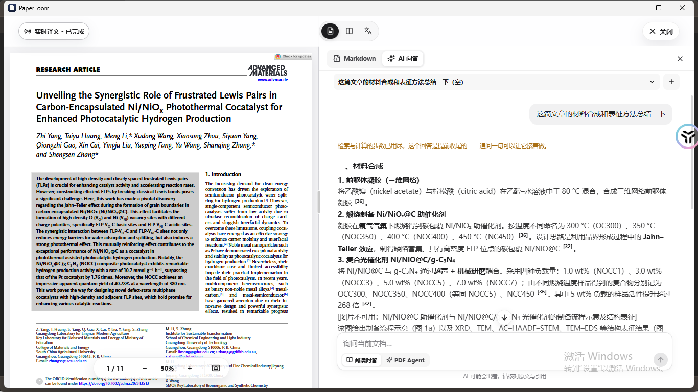

<details>
<summary>Xem bảng tóm tắt phương pháp đặc trưng và trích dẫn</summary>

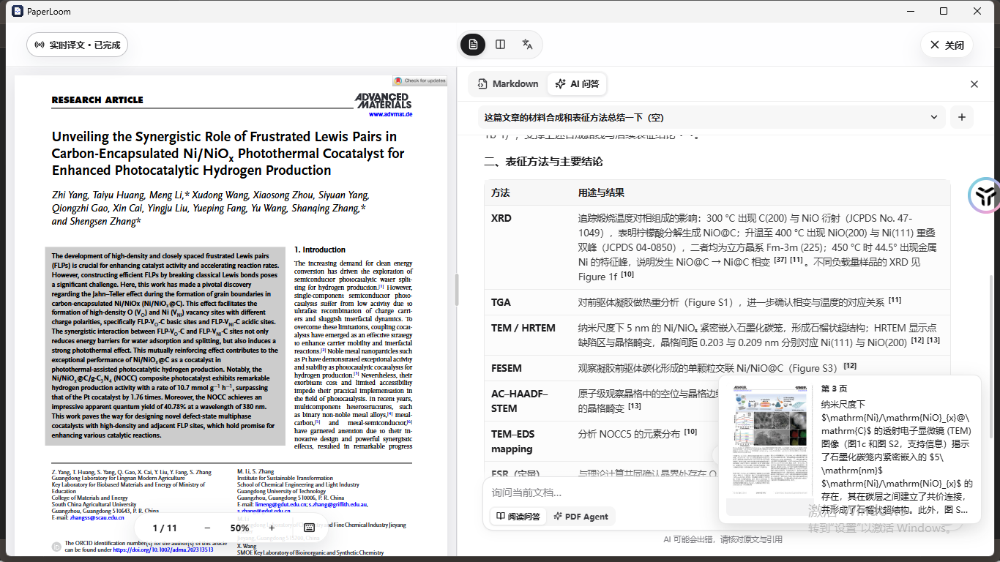

</details>

Câu trả lời này đã chạm giới hạn lượt truy xuất; ảnh vẫn giữ thông báo kết thúc sớm. Hãy đối chiếu câu trả lời AI và kết quả OCR với bản gốc, nhất là điều kiện thí nghiệm, đơn vị và số liệu trong bảng.

### Obsidian: thông tin tài liệu và nội dung ghi chú

Ghi chú xuất ra có tiêu đề, tác giả, năm, DOI, tạp chí, liên kết Zotero và liên kết đến tài liệu cùng tác vụ trong PaperLoom. Ghi chú bản gốc và bản dịch liên kết với nhau; PDF đã dịch và hình ảnh được lưu trong thư mục tài nguyên đi kèm.

Bảng phức tạp giữ dạng HTML và các ô gộp. Plugin tùy chọn HTML Table Math 0.1.2 có thể kết xuất công thức trong bảng. Highlight, chú thích và ghi chú con sẵn có trong Zotero cũng được xuất theo, kèm số trang và liên kết định vị chú thích trong Zotero.

<details>
<summary>Xem frontmatter, nội dung, bảng và chú thích Zotero trong Obsidian</summary>

<table>
  <tr><th>Thông tin thư mục và frontmatter</th><th>PDF nhúng và nội dung tiếng Trung</th></tr>
  <tr>
    <td width="50%"><a href="resources/brand/readme-gallery/product/obsidian-frontmatter-real.png">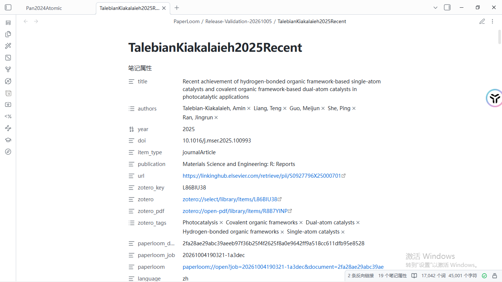</a></td>
    <td width="50%"><a href="resources/brand/readme-gallery/product/obsidian-text-real.png">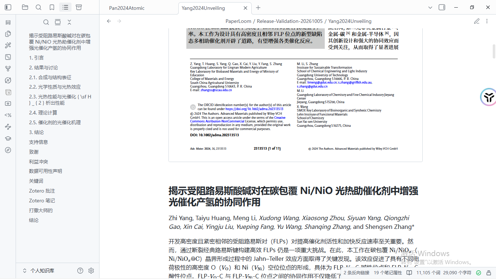</a></td>
  </tr>
  <tr><th>Ô gộp và công thức trong bảng</th><th>Chú thích Zotero và liên kết trang</th></tr>
  <tr>
    <td width="50%"><a href="resources/brand/readme-gallery/product/obsidian-body-real.png">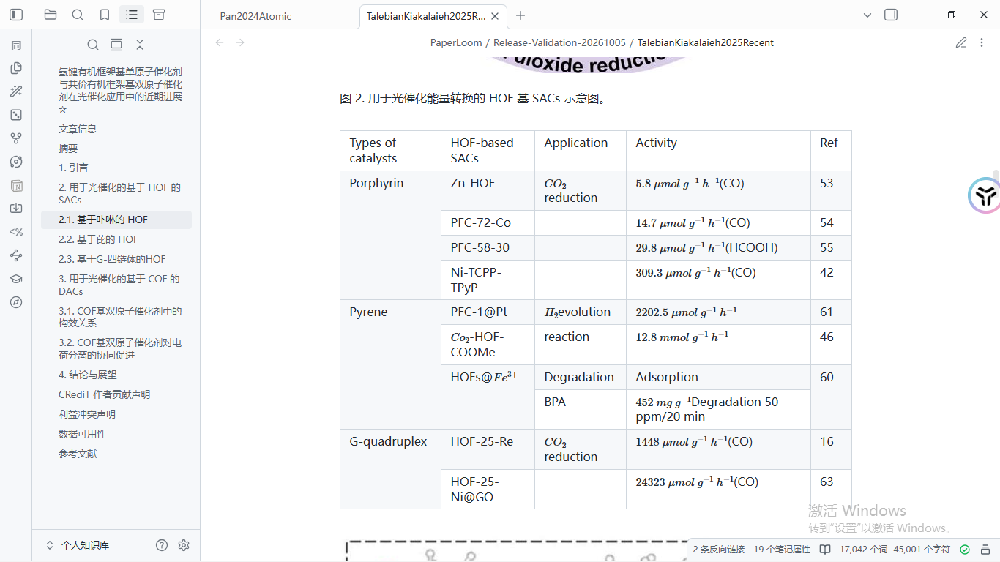</a></td>
    <td width="50%"><a href="resources/brand/readme-gallery/product/obsidian-annotations-real.png">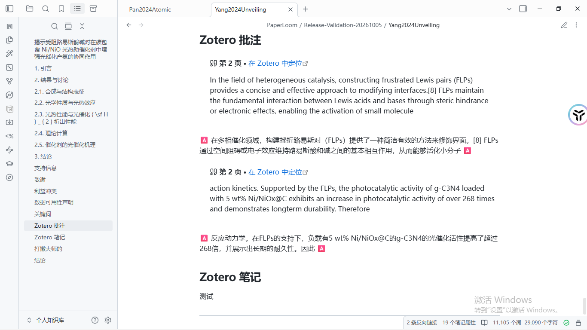</a></td>
  </tr>
</table>

</details>

### Lưu bản dịch về Zotero theo lô

Chọn nhiều tài liệu trong thư viện rồi nhấn Lưu về Zotero để xem kết quả tạo mới, cập nhật hoặc thất bại của từng bài. Lưu lại sẽ cập nhật tệp đính kèm hiện có. Sau đó, PDF bản dịch tiếng Trung của PaperLoom có thể mở trực tiếp trong Zotero.

<details>
<summary>Xem kết quả lưu theo lô và PDF đã dịch trong Zotero</summary>

<table>
  <tr><th>PaperLoom: cập nhật 3 bài, thất bại 0 bài</th><th>Zotero: bản dịch tiếng Trung của Pan 2024</th></tr>
  <tr>
    <td width="50%"><a href="resources/brand/readme-gallery/product/paperloom-zotero-batch-real.png">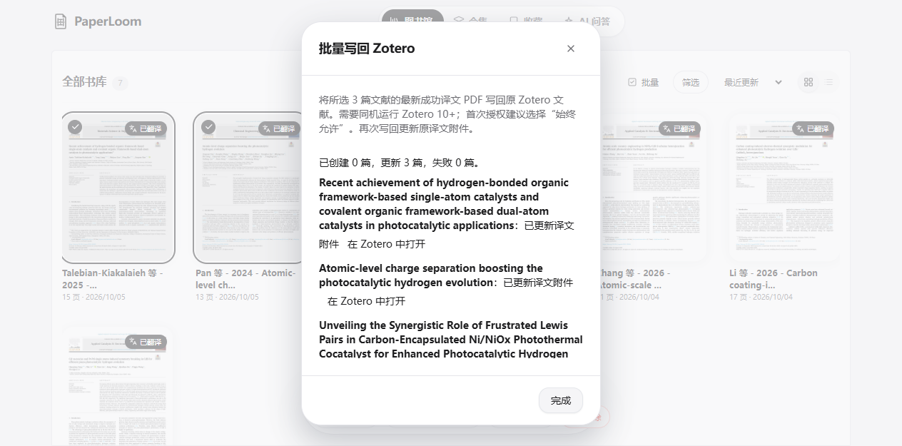</a></td>
    <td width="50%"><a href="resources/brand/readme-gallery/product/zotero-translated-pdf-real.png">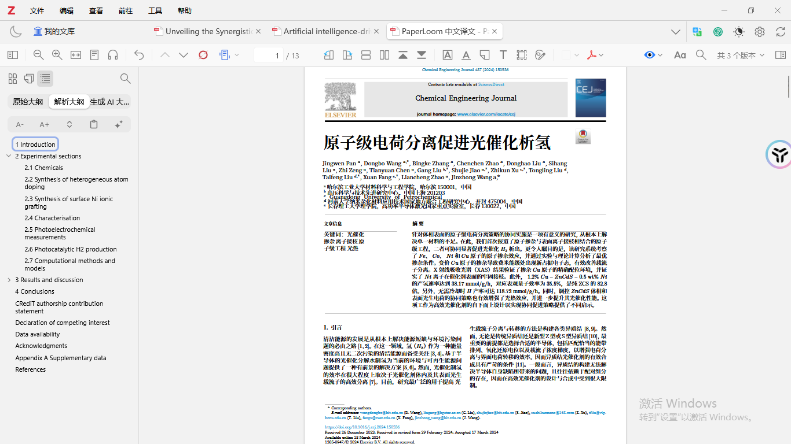</a></td>
  </tr>
</table>

</details>

## Bắt đầu nhanh

Truy cập [GitHub Releases](https://github.com/luffysolution-svg/paperloom/releases) để tải PaperLoom. v0.1.3 cung cấp bộ cài Windows x64 và bản portable; các gói desktop cho macOS và Linux sẽ xuất hiện trên trang phát hành tương ứng khi có sẵn.

1. Mở PaperLoom và nhập thông tin xác thực API của dịch vụ OCR và mô hình dịch trong Cài đặt. Bạn có thể dùng MinerU, PaddleOCR và các mô hình dịch được hỗ trợ.
2. Nhấn Thêm PDF hoặc chọn tài liệu trên máy qua Nhập từ Zotero. Tệp PDF trong Zotero cần được tải về máy trước.
3. Bắt đầu dịch và theo dõi tiến độ trong trung tâm tác vụ.
4. Khi hoàn tất, đọc đối chiếu để kiểm tra văn bản, công thức, hình và bảng. Mở Markdown hoặc hỏi đáp AI khi cần.
5. Xuất tệp trong trang chi tiết, hoặc chọn nhiều tài liệu trong thư viện để lưu sang Obsidian hay về Zotero.

API OCR và mô hình do các dịch vụ tương ứng cung cấp. Hạn mức và phí sử dụng do nhà cung cấp quy định.

Nếu macOS báo ứng dụng bị hỏng, chuyển ứng dụng vào `/Applications` rồi chạy:

```bash
sudo xattr -r -d com.apple.quarantine /Applications/PaperLoom.app
```

### Triển khai bằng Docker

```bash
git clone https://github.com/luffysolution-svg/paperloom.git
cd paperloom/ops/deployment/docker/delivery
python3 init-local.py
docker compose -f docker-compose.yml -f docker-compose.build.yml up -d --build
```

Dùng Docker Compose để dựng PaperLoom từ mã nguồn. Cần Docker Compose, Python 3 và kết nối đến các trang tải thư viện; trên Windows, dùng `python` thay cho `python3`. Lần dựng đầu tải Rust, Python, Node và các thành phần dàn trang nên mất nhiều thời gian hơn những lần khởi động sau. Mở <http://127.0.0.1:45001> và cấu hình API OCR, mô hình của bạn trong ứng dụng. Sau khi cập nhật mã nguồn, chạy lại:

```bash
docker compose -f docker-compose.yml -f docker-compose.build.yml up -d --build
```

Xem [hướng dẫn triển khai Docker](ops/deployment/docker/delivery/README.md) để cấu hình và gắn thư mục.

## Zotero và Obsidian

### Lưu PDF đã dịch về Zotero 10

Trong Zotero, bật Cài đặt → Nâng cao → Cho phép các ứng dụng khác trên máy này giao tiếp với Zotero, rồi giữ Zotero chạy. Sau khi nhập một bài từ Zotero và dịch xong, nhấn Lưu về Zotero trong trang chi tiết. Để lưu theo lô, chọn các bài trong thư viện và dùng cùng nút đó.

Zotero sẽ hiện hộp thoại cấp quyền ở lần ghi đầu tiên. Nên chọn Luôn cho phép; nếu chọn Chỉ cho phép một lần, các bước tải lên sau có thể hỏi lại. PDF được lưu thành tệp đính kèm con mang tên bản dịch tiếng Trung của PaperLoom dưới bài gốc; ghi lại sẽ cập nhật cùng tệp đó. Quyền đã ghi nhớ được lưu trên máy. Nếu xóa quyền trong cài đặt nâng cao của Zotero, lần ghi tiếp theo sẽ cần cấp quyền lại.

Mỗi lô nhận tối đa 200 bài và loại bỏ lựa chọn trùng. Một bài thất bại không làm dừng các bài còn lại. Hệ thống chọn bản dịch thành công mới nhất có PDF thực sự sẵn sàng. Tài liệu không nhập từ Zotero, thiếu PDF đã dịch hoặc Zotero chưa chạy đều có thông báo lỗi tương ứng.

Việc ghi bản dịch về cần **Zotero 10+ và API cục bộ trên cùng máy**. Zotero 9 trở xuống chỉ hỗ trợ nhập. Chế độ Docker gắn thư mục dữ liệu Zotero vẫn chỉ đọc. PaperLoom không ghi trực tiếp vào `zotero.sqlite`. Xem [hướng dẫn tích hợp Zotero và Obsidian](docs/ops/planning/zotero-obsidian-integration.md) để biết cách cấu hình.

### Xuất sang Obsidian theo lô

Chọn các bài trong thư viện, nhấn Lưu sang Obsidian rồi chọn vault và thư mục. Mỗi lô nhận tối đa 200 bài và báo kết quả đã ghi, xung đột, bỏ qua hoặc thất bại cho từng bài. Một bài thất bại không làm dừng cả lô. Có thể xuất kèm ghi chú bản gốc; PDF đã dịch và hình ảnh nằm trong thư mục tài nguyên.

Khi xuất lại, PaperLoom cập nhật các khối nội dung do ứng dụng quản lý và giữ phần bạn viết bên ngoài các khối đó. Chọn đổi tên hoặc bỏ qua nếu muốn giữ tệp hiện có.

**Plugin tùy chọn cho công thức trong bảng: HTML Table Math 0.1.2**. Tìm `html-table-math` trong Community plugins của Obsidian, cài đặt rồi bật plugin. PaperLoom không đóng gói hoặc tự cài plugin. Văn bản thông thường và việc xuất ghi chú không yêu cầu plugin này.

## Câu hỏi thường gặp

### MinerU và proxy hệ thống Windows

Ứng dụng desktop đọc proxy HTTP của Windows và truyền cho các tiến trình phân tích, dịch và tải kết quả. Khởi động lại PaperLoom sau khi đổi proxy; dịch vụ cục bộ và Zotero vẫn kết nối trực tiếp. Nếu ứng dụng proxy chỉ có cổng SOCKS, hãy bật thêm cổng HTTP hoặc cổng hỗn hợp.

Tải lên, phân tích và tải kết quả MinerU là các bước riêng. Nếu tải kết quả thất bại, trước tiên xem thông báo mạng, kiểm tra DNS và proxy; không tắt xác minh chứng chỉ HTTPS. Khi DNS trỏ CDN chính thức đến nút có chứng chỉ hết hạn, PaperLoom cập nhật phân giải tên miền và thử lại trong những điều kiện cụ thể, vẫn giữ xác minh chứng chỉ. Hãy khởi động lại PaperLoom sau khi đổi proxy.

API token chỉ dùng cho yêu cầu API MinerU, không gửi đến CDN kết quả hoặc kho lưu trữ đối tượng. Xem [tài liệu MinerU chính thức](https://mineru.net/apiManage/docs) mới nhất.

### Chọn MinerU hay Paddle OCR?

MinerU và PaddleOCR đều được hỗ trợ, nhưng kết quả xử lý bảng phức tạp và cắt ảnh có thể khác nhau. Hãy kiểm tra công thức, số liệu trong bảng và chú thích hình quan trọng với PDF gốc. Không nên xem một nhóm mẫu là bảng xếp hạng chung.

## Phát triển và lời cảm ơn

Nếu muốn đóng góp, hãy bắt đầu với [hướng dẫn đóng góp](CONTRIBUTING.md), [tài liệu dự án](docs/README.md) và [hướng dẫn backend](backend/README.md). Báo vấn đề bảo mật riêng theo [hướng dẫn báo cáo bảo mật](SECURITY.md); tránh đăng thông tin xác thực hoặc tài liệu riêng tư trong Issue công khai.

Xin cảm ơn tác giả và những người đóng góp cho [RetainPDF](https://github.com/wxyhgk/retain-pdf). PaperLoom tiếp tục phát triển nền tảng đó với trải nghiệm đọc tài liệu, tích hợp Zotero/Obsidian và cải tiến bản desktop. Cũng xin cảm ơn các nhà phát triển MinerU, PaddleOCR, Typst, Zotero, Obsidian và các thư viện mã nguồn mở liên quan.

## Giấy phép

PaperLoom được phát hành theo [GNU AGPL-3.0](LICENSE). Mỗi bản phát hành chính thức cũng cung cấp đầy đủ [mã nguồn tương ứng](CORRESPONDING_SOURCE.md), gồm mã nguồn PyMuPDF/MuPDF khớp với bộ cài đặt và image app. Phần nền tảng RetainPDF giữ nguyên [thông báo bản quyền và giấy phép MIT](LICENSE-MIT); các phần phụ thuộc và tài nguyên khác tiếp tục tuân theo giấy phép riêng như ghi trong [thông báo bên thứ ba](THIRD_PARTY_NOTICES.md).

## Cộng đồng PaperLoom

<table>
  <tr>
    <th width="50%"></th>
    <th width="50%">Nếu mã QR nhóm không còn hiệu lực, hãy<br />thêm WeChat cá nhân của tôi để tôi mời bạn vào nhóm</th>
  </tr>
  <tr>
    <td align="center" valign="top"></td>
    <td align="center" valign="top"></td>
  </tr>
</table>
